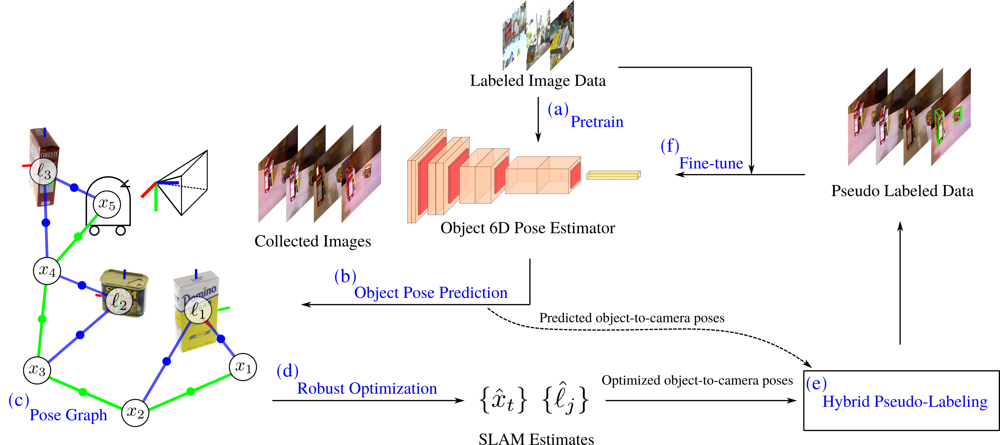

# SLAM-Super-6D
SLAM-Supported Semi-Supervised Learning for 6D Object Pose Estimation

Check out our [paper](https://arxiv.org/pdf/2203.04424.pdf)!

**TLDR**: We exploit robust pose graph optimization results to pseudo-label robot-collected RGB images and fine-tune 6D object pose estimators during object-based navigation.



The two most important features of this work

- A SLAM-aided self-training procedure for 6D object pose estimation.

- Automatic covariance tuning (ACT), a robust pose graph optimization method, enabling flexible uncertainty modeling for learning-based measurements.

## YCB video experiment

We combine [DOPE](https://github.com/NVlabs/Deep_Object_Pose) pose predictions with [ORB-SLAM3](https://github.com/UZ-SLAMLab/ORB_SLAM3) camera odometry to build per-video object-level world representations.
We leverage the consistent state estimates to pseudo-label YCB-v training images and fine-tune the DOPE estimator for selected YCB objects.
Check out the [experiment](experiments/ycbv/) folder for more details.

### Comparison of robust pose graph optimization methods for pseudo-labeling

<details>
    <summary>Click to expand!</summary>

**Table I**: Comparison of robust PGO methods via pseudo label accuracy on YCB-v sequences (training + testing). Column 1-20 are median pseudo label errors (i.e. pixel location errors in projected object 3D bounding boxes computed from optimization results) on YCB video sequences for each test object; Column 21 (#best) is the number of YCB videos on which a method achieves the lowest error; The statistics of DOPE pose predictions are also reported: Row 7 (%Detected) is the percentage of successful object detections out of all the image frames; Row 8 (%Outliers) is the percentage of outliers out of all successful predictions.

|003_cracker_box             |0001    |0004     |0007   |0016    |0017    |0019    |0025    |0029    |0035   |0041    |0044    |0045     |0050    |0054    |0059    |0066    |0070    |0074    |0082     |0085     |#best|
|---                         |:-:     |:-:      |:-:    |:-:     |:-:     |:-:     |:-:     |:-:     |:-:    |:-:     |:-:     |:-:      |:-:     |:-:     |:-:     |:-:     |:-:     |:-:     |:-:      |:-:      |:-:  |
|L-M                         |62.3    |58.7     |13.2   |69.4    |37.6    |110.1   |101.6   |86.1    |9.6    |21.5    |79.4    |140.0    |46.8    |152.7   |152.6   |79.0    |117.3   |139.5   |250.3    |183.2    |0    |
|Cauchy                      |12.4    |**10.8** |10.2   |13.8    |29.5    |94.4    |171.4   |179.9   |**6.6**|9.6     |133.3   |169.9    |16.3    |**13.9**|131.7   |23.8    |**25.5**|102.6   |267.3    |137.5    |4    |
|Huber                       |31.4    |25.4     |10.2   |34.2    |21.6    |52.5    |57.0    |72.4    |8.0    |11.6    |38.7    |**127.8**|21.2    |68.0    |74.8    |46.8    |39.1    |68.7    |267.3    |153.4    |1    |
|Geman-McClure               |**11.5**|168.4    |10.2   |115.0   |48.4    |94.4    |171.4   |179.9   |6.6    |**9.5** |133.3   |169.9    |46.8    |77.1    |131.7   |182.7   |27.0    |102.6   |267.3    |137.5    |2    |
|cDCE (*Pfeifer et al. 2017*)|28.7    |25.4     |10.5   |32.5    |21.1    |**45.2**|58.9    |**70.5**|7.8    |11.5    |38.0    |128.1    |24.4    |56.7    |55.6    |41.3    |37.7    |60.9    |**238.7**|**114.2**|4    |
|ACT (Ours)                  |15.7    |12.0     |**9.4**|**12.6**|**20.3**|52.0    |**15.4**|238.3   |6.9    |10.8    |**28.8**|135.4    |**10.4**|18.7    |**21.3**|**22.3**|26.1    |**34.6**|795.2    |180.0    |**9**|
|%Detected                   |56%     |91%      |90%    |56%     |95%     |91%     |85%     |68%     |98%    |97%     |79%     |76%      |96%     |23%     |55%     |61%     |52%     |22%     |12%      |72%      |-     |
|%Outliers                   |37%     |51%      |11%    |29%     |32%     |76%     |58%     |80%     |4%     |19%     |55%     |95%      |51%     |55%     |73%     |55%     |47%     |67%     |99%      |82%      |-     |

|004_sugar_box               |0001   |0014    |0015    |0020    |0025    |0029    |0033   |0036    |0037    |0043   |0049    |0051   |0054    |0055    |0058   |0060    |0074    |0077    |0085    |0089    |#best |
|---                         |:-:    |:-:     |:-:     |:-:     |:-:     |:-:     |:-:    |:-:     |:-:     |:-:    |:-:     |:-:    |:-:     |:-:     |:-:    |:-:     |:-:     |:-:     |:-:     |:-:     |:-:   |
|L-M                         |22.9   |27.1    |100.9   |21.1    |57.3    |78.7    |7.1    |14.7    |15.7    |21.0   |14.8    |11.8   |57.9    |41.2    |48.7   |67.0    |71.5    |68.3    |67.7    |89.8    |0     |
|Cauchy                      |8.3    |13.4    |30.4    |21.9    |22.3    |104.4   |6.4    |11.7    |10.6    |16.1   |**8.8** |9.3    |54.8    |16.4    |11.8   |47.5    |39.3    |16.1    |31.4    |42.6    |1     |
|Huber                       |11.7   |12.8    |35.5    |15.8    |23.4    |**71.1**|6.6    |12.5    |11.3    |15.7   |10.9    |9.8    |30.2    |16.7    |11.1   |**47.2**|**26.4**|22.7    |33.7    |32.9    |3     |
|Geman-McClure               |9.4    |**11.4**|**29.1**|**14.3**|19.6    |104.4   |6.4    |10.9    |**10.2**|**7.4**|10.5    |8.3    |54.8    |38.5    |10.0   |76.2    |61.5    |15.6    |31.4    |**24.9**|6     |
|cDCE (*Pfeifer et al. 2017*)|12.3   |12.0    |31.6    |14.9    |20.0    |72.7    |6.5    |13.5    |11.1    |16.3   |10.9    |9.4    |35.4    |21.8    |18.3   |60.8    |27.1    |29.9    |28.7    |28.1    |0     |
|ACT (Ours)                  |**8.2**|15.9    |34.2    |15.1    |**18.0**|100.5   |**6.1**|**10.5**|10.2    |16.7   |9.2       |**8.3**|**19.4**|**11.8**|**8.6**|55.5    |35.4    |**14.4**|**23.0**|40.3    |**10**|
|%Detected                   |61%    |92%     |32%     |68%     |45%     |23%     |100%   |100%    |92%     |58%    |63%     |64%    |64%     |60%     |100%   |32%     |39%     |35%     |41%     |26%     |-     |
|%Outliers                   |8%     |11%     |15%     |18%     |13%     |100%    |2%     |14%     |14%     |3%     |4%      |2%     |60%     |31%     |20%    |47%     |21%     |29%     |43%     |16%     |-     |

|010_potted_meat_can         |0002    |0005    |0008    |0014    |0017    |0023    |0026   |0029    |0034   |0039    |0043    |0047    |0049    |0053    |0059    |0060    |0061    |0073     |0077     |0087    |#best|
|---                         |:-:     |:-:     |:-:     |:-:     |:-:     |:-:     |:-:    |:-:     |:-:    |:-:     |:-:     |:-:     |:-:     |:-:     |:-:     |:-:     |:-:     |:-:      |:-:      |:-:     |:-:  |
|L-M                         |35.2    |38.1    |61.4    |59.2    |31.1    |32.8    |17.5   |22.1    |13.8   |43.1    |39.5    |67.8    |151.1   |42.7    |17.8    |87.2    |47.6    |337.3    |247.8    |24.5    |0    |
|Cauchy                      |10.8    |14.9    |**10.7**|12.2    |**14.2**|**11.7**|11.4   |32.4    |10.1   |22.9    |16.4    |13.2    |14.3    |12.4    |**12.8**|**32.3**|45.7    |**320.9**|193.4    |22.6    |6    |
|Huber                       |11.1    |17.1    |14.6    |16.6    |18.6    |15.5    |11.8   |16.9    |10.7   |**18.0**|15.0    |15.2    |89.8    |12.8    |13.4    |42.9    |27.5    |359.2    |201.6    |25.5    |1    |
|Geman-McClure               |**10.4**|15.3    |11.9    |13.2    |18.9    |15.2    |**9.1**|**14.1**|9.9    |20.0    |16.3    |14.0    |14.4    |**12.3**|13.0    |55.0    |42.7    |320.9    |209.4    |**19.9**|5    |
|cDCE (*Pfeifer et al. 2017*)|11.5    |16.2    |16.1    |20.5    |17.8    |15.3    |11.2   |18.4    |11.6   |19.2    |16.5    |17.2    |54.5    |13.1    |13.9    |34.9    |**27.2**|385.8    |195.5    |23.4    |1    |
|ACT (Ours)                  |13.3    |**14.5**|12.8    |**11.3**|19.1    |14.0    |10.4   |21.6    |**9.7**|20.2    |**13.5**|**13.0**|**13.3**|16.0    |13.4    |40.9    |28.9    |385.6    |**192.7**|20.6    |**7**|
|%Detected                   |93%     |86%     |88%     |60%     |73%     |87%     |71%    |33%     |100%   |99%     |100%    |98%     |49%     |59%     |88%     |15%     |41%     |1%       |7%       |44%     |-     |
|%Outliers                   |9%      |16%     |26%     |21%     |16%     |10%     |6%     |5%      |8%     |14%     |10%     |16%     |30%     |16%     |4%      |41%     |7%      |100%     |100%     |11%     |-     |

</details>

### Pose estimation and SLAM results on test sequences

<p align="middle">
    
    
    <!--  -->
    <!--  -->
</p>

## Installing

Create a [conda](https://www.anaconda.com/products/individual) environment.

```
cd /path/to/slam-super-6d
conda env create -f environment.yml
```


## Developing

We're using [pre-commit](https://pre-commit.com/) for automatic linting. To install `pre-commit` run:
```
pip3 install pre-commit
```
You can verify your installation went through by running `pre-commit --version` and you should see something like `pre-commit 2.14.1`.

To get started using `pre-commit` with this codebase, from the project repo run:
```
pre-commit install
```
Now, each time you `git add` new files and try to `git commit` your code will automatically be run through a variety of linters. You won't be able to commit anything until the linters are happy with your code.
